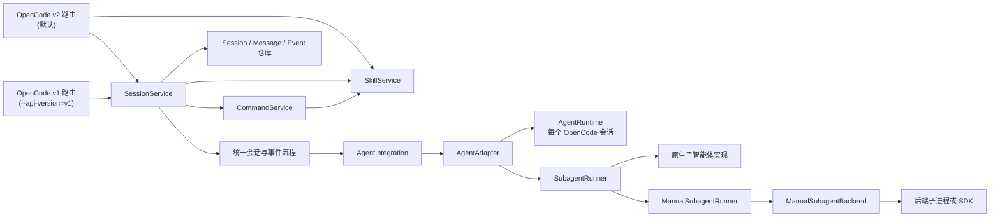

# Agent 接口设计

本文档描述 `opencode-server-adaptor` 的后端扩展接口，以及主智能体、运行时、子智能体和 Skill 之间的职责边界。

项目目前只接入 Pi coding agent，但 OpenCode 路由、会话管理和消息持久化不直接依赖 Pi 类型。新增后端时，应通过
本文档中的接口接入，不应把后端协议判断加入 OpenCode API 主流程。

## 设计目标

- OpenCode Server 层只处理统一的 Agent 接口和事件。
- 后端的进程管理、SDK、RPC、模型配置和事件格式保留在自己的实现目录中。
- 一个服务可以同时安装多个不同的 Agent 后端。
- 原生支持子智能体的后端可以直接调用原生能力。
- 不支持原生子智能体的后端可以复用统一的 fallback 编排。
- 接口只保留主流程实际调用的能力，不使用 capability flag 声明无法消费的功能。

## 总体结构



### OpenCode 协议边界

定义位置：

- [`src/api/routes/v2-session.ts`](src/api/routes/v2-session.ts)：v2 会话协议映射。
- [`src/api/routes/v2.ts`](src/api/routes/v2.ts)：Agent、provider、项目、文件系统和 PTY 等 v2 HTTP 接口。
- [`src/api/routes/v2-permission.ts`](src/api/routes/v2-permission.ts)：Desktop 固定探测的无状态 v2 permission 兼容端点。
- [`src/api/routes/v1-legacy.ts`](src/api/routes/v1-legacy.ts)：v1 专属路由（配置与检查层）。
- [`src/api/routes/v1-compatible-legacy.ts`](src/api/routes/v1-compatible-legacy.ts)：两种模式都挂载的兼容路由（配置、会话删除和 Desktop 文件树）。
- [`src/event/session-events-legacy.ts`](src/event/session-events-legacy.ts)：尚无 current 等价物的 Desktop 通知事件。
- [`src/api/version.ts`](src/api/version.ts)：`--api-version` 选项与默认版本。
- [`src/session/session-service.ts`](src/session/session-service.ts)：协议无关的会话应用服务。
- [`src/event/session-event-store.ts`](src/event/session-event-store.ts)：v2 持久事件序列。

路由层只处理请求校验、协议字段转换、状态码和错误 envelope。会话创建、模型解析、prompt 排队、Runtime 调用、
消息投影、压缩、回退、终止和启动恢复都必须通过同一个 `SessionService`，不能在路由内复制事件流程。
后端 Adapter 和 Runtime 不感知 OpenCode HTTP 字段。

服务默认启用 v2，可通过 `--api-version=v1` 切换为 v1。`/api/health` 返回数值型 `pid`，
`/global/health` 不注册并返回 404，以匹配 OpenCode 的协议探测顺序。v1 模式下挂载
`v1-legacy.ts` 和 `v1-compatible-legacy.ts`；v2 模式下挂载 `v2.ts`、`v2-session.ts`、`v2-permission.ts`、`event.ts` 和
`v1-compatible-legacy.ts`。`v1-compatible-legacy.ts`（`GET /config`、`DELETE /session/:id`）在两种模式下都挂载。
Desktop 启动时固定探测 permission API，因此 `v2-permission.ts` 保留无状态兼容响应：列表恒为空，创建请求返回不支持，
读取或回复不存在的请求返回 404。适配器不保存 permission 请求或选择，也不把 Pi extension UI 映射成 OpenCode permission。

### 应用层与持久化边界

`src/server.ts` 是唯一组合根。它创建 repository、应用服务、integration 和路由，并通过构造参数显式连接依赖。
`SessionRepository`、`MessageRepository` 和 `SessionEventStore` 分别拥有自己的业务表查询；路由和 `AgentService`
不直接执行这些表的 SQL。项目目录查询也不会在 v1/v2 路由中各复制一份。

provider/model 的通用目录模型与构建逻辑位于 [`src/provider/index.ts`](src/provider/index.ts)。后端 integration 可以贡献
内置 provider，但不需要依赖 HTTP 路由模块；`src/api/provider.ts` 仅作为旧导入路径的兼容导出。

通用 `EventBus` 发布 OpenCode current 会话事件；主消息流不再发送已被替代的 `message.updated`、
`message.part.updated`、`message.part.delta` 和 `session.status`。输入、execution、step、text、reasoning、tool、
重试和压缩的生命周期边界由 `SessionEventStore` 保存为每个 session 单调递增的 durable sequence，并同时发送到
`/api/event`；text/reasoning/tool-input delta 与 tool progress 只实时发送，不写数据库。tool success/failed 使用
durable version 2，其余当前边界使用 version 1。尚无 current 等价物的 `session.idle`、`session.error`、
`message.removed` 和 `session.compacted` 集中在 `session-events-legacy.ts`，并继续由 `EventBus` 发送。其中
`session.idle` 和 `session.error` 承担 Desktop 的完成唤醒与错误通知。标准的 `session.created`、
`session.updated`、`session.deleted`、`session.forked` 和 PTY 事件仍属于 current 全局事件，不归入 legacy 文件。

持久事件订阅先注册实时监听，再回放数据库历史并按 sequence 去重，避免回放与实时切换窗口内丢失事件。客户端重连也可
直接重新读取 `/api/session/:sessionID/message` 获取消息快照；持久事件主要用于有游标的增量恢复。日志优化器处理 current
SSE envelope，保留事件身份、生命周期和统计，但不重复输出累积文本或工具结果。

### 会话级有序 ID 格式

默认继续生成 OpenCode 兼容的 legacy ID：`<prefix>_<12 hex><14 base62>`。当客户端提交的消息 ID 以 `msg-`
开头时，`SessionService` 将该 session 持久切换为 wide ID 模式；随后由服务端生成的消息、part、实时事件和 durable
事件分别使用 `msg-`、`prt-` 和 `evt-`。wide ID 格式为
`<prefix>-<14 hex><14 base62>`：前 14 位十六进制由 44-bit 逻辑毫秒时间戳和 12-bit 同毫秒计数器组成，即
`logicalTimestamp * 4096 + counter`；同毫秒并发或系统时钟回拨时继续单调递增，
随机尾部只负责降低跨进程冲突概率。

`-` 的字典序低于 legacy ID 分隔符 `_`，因此同一 session 混用两种格式时，wide ID 会排在 legacy ID 之前；
正常用法是在会话第一条客户端消息即使用 `msg-`，避免混用。

ID 模式保存在 session 的内部 metadata 中，重启后继续生效；手动和模型原生 subtask 创建的子 session 继承父 session
模式。session 本身在收到第一条消息前已经创建，因此其 `ses_` ID 不改写，子 session ID 也仍使用 legacy `ses_`；
权限、tool call、PTY 和 RPC ID 不参与消息/part 时间排序，也不切换格式。客户端明确传入的 message/part ID 原样保留，
格式策略只控制适配器后续生成的 ID。

`SessionRepository` 为事件路由维护一个仅包含 `directory` 和 `idFormat` 的进程内 cache。两者会被每个实时事件使用，
因此必须一起读取和缓存，避免 token delta 为目录路由和 ID 格式重复查询 SQLite。session 创建或列表读取会预热 cache，
目录更新和 wide 切换会同步刷新，递归删除会清除父子 session 条目；SQLite 仍是重启后的持久化真相来源。其他 Session
字段不进入该 cache。

### Assistant Part Message 投影

部分 v2 客户端会在同一 message 内按重建后的 part ID 排序，可能在历史加载时改变 reasoning、tool 和 text 的先后顺序。
因此默认投影下，第一组 assistant part 复用 prompt 预创建的 message；后续 part 与前一 part 类型相同时继续写入当前
message，类型变化时创建一条同 parent user message 的有序 sibling message。客户端提交的 user message 及其
text/file/agent/subtask part 不拆分，否则会错误增加用户轮次。

默认投影只改变 OpenCode 展示结构，不改变 Runtime 的 `PromptInput.assistantMessageId`；后端整轮仍使用原始 root message
ID 上报事件，`AssistantPartProjector` 维护 root 到 sibling message 的进程内映射。`message_completed` 会统一关闭整组
message，只有最后一个实际含 part 的 message 保存最终 `finish` 和 usage；错误也只归属该 terminal message。

指定 `serve --msg-part-encap` 后，一次请求产生的所有 assistant part 都保留在预创建的单条 response message 中，不再
生成 sibling message。该模式适用于要求一次请求与一次响应一一对应的调用方，但在上述 v2 客户端中可能出现 part 顺序
错乱。两种模式下 `session_idle` 都是独立的执行终态，不得由任意单条 message 的完成推导；启动恢复仍以数据库中所有
未完成 assistant message 为准，不依赖进程内映射。

六个主要边界：

| 边界               | 生命周期     | 职责                                                           |
| ------------------ | ------------ | -------------------------------------------------------------- |
| `AgentIntegration` | 服务级       | 向服务贡献 adapter、factory、provider、配置监听器和日志优化器  |
| `AgentAdapter`     | Agent 定义级 | 描述一种具体 Agent，校验配置并创建会话 Runtime                 |
| `AgentRuntime`     | 会话级       | 执行 prompt、终止运行、处理权限并产生统一事件                  |
| `SubagentRunner`   | Adapter 级   | 发现和执行该 Agent 可用的子智能体                              |
| `SkillService`     | 目录级       | 发现、校验和解析 Skill；为列表、command 和自动调用提供同一真相 |
| `CommandService`   | 目录级       | 合并普通 command 和 Skill，并解析 Desktop slash 调用           |

## Skill 接入方案

本节描述当前 Skill 接入接口。`GET /api/skill`、Skill 合并后的 `GET /api/command`、
`POST /api/session/:sessionID/command` 和 Pi 自动发现均复用本节定义的目录快照；后续扩展不应把 Skill 发现或 command
展开堆回 `v2.ts`。

本设计以仓库目标协议 OpenCode `1.18.7` 为基线，同时核对了相邻 OpenCode `1.18.11` Desktop/App 和 Pi `0.82.0`
源码。一个容易误判的客户端行为必须先固定下来：

- Desktop 不读取 `/api/skill` 来构建 slash 菜单，而是读取 `/api/command`；命中 `/name` 后调用
  `POST /api/session/:sessionID/command`。因此 Skill 必须同时进入 Skill catalog 和 Command catalog，不能只实现
  `/api/skill`。

### 核心原则

- **一个能力真相来源**：客户端列表、客户端显式选择和模型自动调用必须使用同一次目录解析产生的目录项和稳定 ID。
- **能力归应用层管理**：Skill 发现和 command 展开不是 HTTP 路由职责，也不是某个模型 provider 的配置。
- **后端只做协议桥接**：Runtime 消费应用层给出的确定性 Skill snapshot；后端可以复用自己的 Skill 机制，但不能再独立扫描
  一套目录。
- **按 location 隔离**：Skill 依赖项目目录。缓存、revision 和错误状态至少以规范化后的 `directory` 为作用域。
- **显式输入在 admission 时冻结**：command 展开的 Skill 正文、来源和 revision 与 user message 一起持久化；排队和恢复时不
  重新读取变化后的文件。
- **不新增 capability flag**：是否支持 Skill 由实际 snapshot 和后端映射决定，主流程不维护与真实方法脱节的布尔声明。

`src/server.ts` 创建 `SkillService` 和依赖它的 `CommandService`，并显式注入 v2 路由、`SessionService` 与 `AgentService`。
路由只做协议转换；目录扫描、冲突处理、模板展开和 snapshot 生成都留在应用层。

### SkillService：发现与解析

```ts
export interface SkillInfo {
  name: string
  description?: string
  slash: boolean
  location: string
  content: string
}

export interface ResolvedSkill extends SkillInfo {
  baseDirectory: string
  files: readonly string[]
  digest: string
  disableModelInvocation: boolean
}

export interface SkillCatalogSnapshot {
  revision: string
  directory: string
  skills: readonly ResolvedSkill[]
}

export interface SkillService {
  list(directory: string): Promise<readonly SkillInfo[]>
  require(directory: string, name: string): Promise<ResolvedSkill>
  snapshot(directory: string): Promise<SkillCatalogSnapshot>
}
```

发现器读取 `SKILL.md` frontmatter 中的 `name` 和 `description`，正文作为 `content`；协议响应中的 `description` 虽为可选，
但统一 catalog 按 Pi/Agent Skills 规范要求其非空，缺失时只记录诊断并排除该文件。同时识别 Pi 的可选
`disable-model-invocation`，只控制自动模型发现，不影响 slash command。Pi 目录根部带 frontmatter 的单文件 `.md` 也按原生
规则加载。至少兼容 OpenCode 使用的项目级
`.opencode/{skill,skills}/**/SKILL.md`、`.agents/skills/**/SKILL.md`、`.claude/skills/**/SKILL.md`，以及对应的用户级目录。
Pi integration 再由组合根固定贡献以下两个目录，不把 Pi 路径判断写进通用扫描器：

- 用户共享目录：`~/.pi/agent/skills`；
- 当前工程目录：`<ProjectDir>/.pi/skills`。

这两个目录都遵循 Pi 的原生约定。`ProjectDir` 必须由 OpenCode directory/project 定位结果确定，不能使用服务进程的启动
目录；它对应 Pi 原生 discovery 中的 `cwd`。最终获胜路径仍通过 `--skill` 显式传入 Pi，避免子进程的隔离配置影响用户级
Skill，同时保证 API catalog 和 Pi catalog 一致。

适配器给 Pi 子进程指定的 `agentDir` 位于自身状态目录，仅用来隔离 `models.json`、`auth.json` 和运行扩展；该目录不存放、
扫描或复制 Skill，也不作为 Skill fallback。`SkillService` 应显式扫描上述用户共享目录和当前工程目录（目录不存在时视为空），
完成去重和冲突裁决后，再把获胜文件传给 Pi。这样每个工程会同时看到用户共享 Skill 与工程私有 Skill，并且 API catalog
与模型实际可用的 catalog 保持一致。

同名 Skill 必须采用固定优先级并记录一条带两个 location 的警告；建议顺序为“显式配置路径 > 当前项目 > 用户目录 >
内置”，同一层按规范化路径排序后后者覆盖前者。单个文件解析失败只排除该 Skill，并发布可诊断错误，不应让整个
`GET /api/skill` 失败。

`GET /api/skill` 直接映射 `SkillService.list(location.directory)`，返回 OpenCode `SkillV2Info`：

```json
{
  "location": { "directory": "/workspace", "project": { "id": "...", "directory": "/workspace" } },
  "data": [
    {
      "name": "review",
      "description": "Review a change",
      "slash": true,
      "location": "/workspace/.agents/skills/review/SKILL.md",
      "content": "..."
    }
  ]
}
```

`/api/skill` 按协议返回完整 `content`，但 Desktop 的 slash 菜单并不消费该接口；真正给 Desktop 的显式入口由下面的
`CommandService` 提供。可以按目录 revision 缓存已解析正文，并通过文件 watcher 失效缓存。

### CommandService：Desktop 的显式 Skill 入口

新增目录级 `CommandService`，将内置 command、用户 command 和可显式使用的 Skill 合并为 `GET /api/command` 的唯一
数据源。OpenCode Desktop 当前的实际链路是：

1. Desktop 请求 `GET /api/command` 并把返回项加入 slash 菜单；它不会为 Skill 单独请求 `/api/skill`。
2. 用户输入 `/review args` 后，Desktop 发送 `POST /api/session/:sessionID/command`，只携带 command name、arguments、
   agent/model 和附件，不发送服务端返回的 template。
3. `SessionService.command()` 按 session directory 调用 `CommandService.require()`，在服务端解析 template 和参数，然后复用
   普通 prompt admission/执行流程；route 不直接调用 Runtime。

```ts
export interface ResolvedCommand {
  name: string
  source: "command" | "skill"
  description?: string
  template: string
  agent?: string
  model?: ModelRef
  subtask?: boolean
  revision: string
}

export interface CommandService {
  list(directory: string): Promise<readonly CommandV2Info[]>
  require(directory: string, name: string, argumentsText: string): Promise<ResolvedCommand>
}
```

Skill command template 为 Skill 正文加基础目录说明。参数展开与 OpenCode command 一致：支持 `$1`、`$2` 和
`$ARGUMENTS`；没有占位符时把完整 arguments 追加到模板末尾。Skill source 不执行 command 模板的 shell substitution，Skill
引用的脚本仍应由模型通过正常工具和权限生命周期执行。解析后的正文、source、name 和 revision 与 user message 一起持久化，
保证 exact retry、排队和重启恢复不会重新读取变化后的文件。未知 command 返回 typed error，不能把 name 当文件路径使用。

名称冲突必须确定化：先注册内置/配置 command，Skill 只在名称仍空闲时加入，因此普通 command 优先。`list()` 和
`require()` 必须共享同一 catalog，禁止列表显示 A、执行却命中 B。

当前公开 SDK 和 Desktop 没有实际调用结构化 `POST /api/session/:sessionID/skill`；OpenCode 新 core 中该操作仍标为
`OperationUnavailableError`。因此本阶段不新增 speculative skill endpoint、`session.skill.activated` 事件或 Skill 专属 message；
显式 Skill 使用现有 command/prompt/message 持久化链路即可。

### Skill 自动调用

自动调用不能在 `SessionService` 中用关键词预选。`SkillCatalogSnapshot.skills` 包含名称、描述、location 和 digest；Runtime
根据后端能力把目录暴露给模型，完整正文仅在模型选中后读取。

Pi `0.82.0` 的原生行为不是一个名为 `skill` 的工具，而是：把可模型调用的 Skill 以 XML catalog 加入 system prompt，提示
模型使用 `read` 读取对应 `SKILL.md`；`disable-model-invocation: true` 的项不进入 catalog。它还支持显式
`/skill:<name> args` 展开。该 catalog 只在 `read` 工具处于 active tools 时注入；禁用 `read` 的 agent 不得声称支持自动
Skill。Pi adapter 应复用这一机制，但 Skill 路径必须来自 `SkillService`，不能让 Pi 再独立扫描一套目录。

这意味着 Pi 的自动 Skill 使用会投影为普通 `read` 工具调用，而不是 OpenCode 原生实现中的 `skill` 卡片；相关权限也沿用
现有 `read` 工具生命周期。该差异不影响 Desktop 的列表、slash command 或历史协议，不需要新增 Skill 专属 assistant part。

### Pi 映射

Pi 已支持 `--skill <path>`、`--no-skills` 和 Skill command 展开，接入时采用以下映射：

- `PiAgentAdapter.createRuntime()` 从 `AgentRuntimeContext.skills.skills` 获取获胜 Skill 的确定性路径列表，以
  `--no-skills --skill <path> ...` 启动 Pi。Pi `0.82.0` 的 `noSkills` 只关闭默认/package discovery，仍会合并显式 CLI path，
  因此无需隔离目录；契约测试固定这一组合语义。只传冲突处理后的获胜路径，确保 `/api/skill`、`/api/command` 和 Pi catalog
  一致。该列表来自 `~/.pi/agent/skills` 与 `<ProjectDir>/.pi/skills` 等 `SkillService` 已裁决的协议目录，不得从 adaptor
  的 Pi `agentDir` 补充 Skill。
- 显式 `/skill-name args` 已由 `CommandService` 在 admission 时展开成 Skill 正文快照；不要把原始 `/skill:<name>` 延迟到
  Pi 执行时再读文件。Pi 原生 `/skill:<name>` 只作为行为参考或直接使用 Pi CLI 时的兼容入口。
- Skill revision 改变时，在下一安全轮次前重建 Pi Runtime 并继续使用原 Pi session 文件。当前 Pi RPC 没有独立的远程资源重载
  command；不能滥用 prompt 发送内部 `/reload` 来改变用户对话。
- `plan` adapter 使用同一份 Skill snapshot。由于 plan 的 active tools 包含 `read`，Pi 会正常加入自动 Skill catalog；若某个
  自定义 agent 禁用 `read`，则只保留客户端显式 command 路径。

### 一致性、错误与安全约束

- Skill catalog 使用原子 revision；一次 `SkillCatalogSnapshot` 内不能混合不同扫描批次的 metadata 和正文。
- 未知 Skill 使用稳定的 `SkillNotFoundError`，并返回排序后的可用名称；不要降级成空 prompt 或 `UnknownError`。
- Skill location、基础目录和附属文件都必须经过规范化路径检查；客户端传入的 Skill name 永远不能直接拼接为文件路径。
- 列表可以缓存，但 command admission 必须确认 snapshot revision 仍有效；失效时重新解析整个 catalog，而不是只刷新单个文件。
- 服务关闭时先停止接收 prompt，再停止 Runtime，最后关闭数据库；Skill watcher 和缓存失效监听器也要随服务关闭。

### 实现与测试

当前实现已完成 `SkillService`、Skill → command 合并、Desktop command admission、Runtime revision 和 Pi 显式 Skill path
映射。测试覆盖目录优先级、坏 frontmatter、附件 revision、参数展开、Desktop slash 链路，以及 Pi 的
`--no-skills --skill <path>` 启动参数。真实模型自动选择 Skill 的场景保留在真实 Pi 测试中验证。

契约测试至少验证三条路径：Skill 同时出现在 `/api/skill` 和 `/api/command`；Desktop command 提交可执行、可 exact retry 并可
重启重放；同一 Skill 可被 Pi 根据描述自动发现并通过 `read` 加载。真实 Pi 测试使用只读 Skill fixture，避免修改工作区。

## AgentIntegration：后端装配边界

定义位置：[`src/agents/agent-integration.ts`](src/agents/agent-integration.ts)。

```ts
export interface AgentIntegration {
  adapters: readonly AgentAdapter[]
  factories?: readonly AgentAdapterFactoryRegistration[]
  providers?: readonly BuiltinProviderDefinition[]
  providerConfigListeners?: readonly ProviderConfigChangeListener[]
  interactionPayloadOptimizers?: readonly AgentInteractionPayloadRegistration[]
  skillDirectories?: readonly SkillDirectoryRegistration[]
  defaultAdapterType?: string
  defaultModel?: string
}

export interface AgentIntegrationContext {
  config: AppConfig
  db: DatabaseService
  providerConfig: ProviderConfigStore
  logger: Logger
}

export type AgentIntegrationFactory = (context: AgentIntegrationContext) => AgentIntegration
```

### 字段语义

- `adapters`：安装到服务中的内置 Agent 实例。例如 Pi integration 提供默认的 `pi` adapter。
- `factories`：按类型动态创建 adapter 的工厂。扩展接口 `POST /api/agent` 注册自定义 Agent 时使用。
- `providers`：提供给 OpenCode Desktop 的内置 provider/model 描述。
- `providerConfigListeners`：`providers.yaml` 中 provider、model 或 API key 变化后的监听器。
- `interactionPayloadOptimizers`：针对后端协议日志的可选优化器，用于去除重复快照等冗余内容。
- `skillDirectories`：后端贡献的 Skill 目录。Pi 用它注册 `~/.pi/agent/skills` 和项目 `.pi/skills`。
- `defaultAdapterType`：没有显式指定类型时，用于创建动态 Agent 的 adapter 类型。
- `defaultModel`：提供给 OpenCode 客户端的默认模型标识，格式为 `provider/model`。

`AgentIntegrationFactory` 会收到服务配置、数据库、用户可编辑的 provider 配置仓库和 logger。后端可以在工厂闭包中
创建共享资源，再把这些资源注入多个 adapter。Server 不需要知道这些资源的具体类型。

### 安装规则

`installAgentIntegrations()` 会：

1. 注册所有内置 adapter。
2. 注册所有动态 adapter factory。
3. 汇总 provider、配置监听器和日志优化器。
4. 优先选择包含 `defaultAgent` 的 integration 作为默认元数据来源。

重复的 adapter ID 或 factory type 会直接报错，防止后注册的后端静默覆盖已有实现。

服务嵌入方可以通过 `createServerContext()` 的 `agentIntegrations` 选项替换内置 Pi integration：

```ts
const context = createServerContext(config, logger, {
  agentIntegrations: [createMyAgentIntegration],
})
```

## AgentAdapter：具体 Agent 定义

定义位置：[`src/agents/agent-adapter.ts`](src/agents/agent-adapter.ts)。

```ts
export interface AgentAdapter {
  readonly id: string
  readonly displayName: string
  readonly mode?: "primary" | "subagent" | "all"
  readonly subagents?: SubagentRunner
  readonly removable?: boolean

  validateConfig(input: unknown): Promise<AgentAdapterConfig>
  getRuntimeConfig?(model: AgentModel | undefined): AgentAdapterConfig
  getRuntimeRevision?(input: AgentRuntimeRevisionInput): string | number | undefined
  generateTitle?(directory: string, prompt: string, model: AgentModel | undefined): Promise<string | null>
  close?(): Promise<void>
  createRuntime(context: AgentRuntimeContext): Promise<AgentRuntime>
}
```

一个 Adapter 表示一个可被会话选择的具体 Agent，例如内置 `pi` 或用户创建的 `review-agent`。它不是一次运行，也不应
保存某个 prompt 的临时状态。

### 标识和元数据

- `id`：服务内唯一的 Agent ID，会存入 OpenCode session。
- `displayName`：OpenCode 客户端展示的名称。
- `mode`：在 OpenCode Agent 列表中的用途。省略时，默认 adapter 为 `primary`，其他 adapter 为 `subagent`。
- `removable`：是否允许通过 Agent API 删除。内置 Agent 通常设为 `false`。
- `subagents`：该 Agent 的子智能体实现；不存在时，主流程会拒绝该 Agent 的子任务。

### Runtime 配置

主流程按以下顺序产生 Runtime 配置：

```text
OpenCode 请求中的 model
  → adapter.getRuntimeConfig(model)
  → adapter.validateConfig(config)
  → AgentRuntimeContext.config
  → adapter.createRuntime(context)
```

- `getRuntimeConfig()` 将通用的 `providerID/modelID` 转换成后端配置。
- 未实现 `getRuntimeConfig()` 时，默认配置是 `{ model }`。
- `validateConfig()` 必须返回已验证配置；配置无效时应抛出可读错误。
- `createRuntime()` 只会收到 `validateConfig()` 成功返回的配置。

### 配置修订

```ts
export interface AgentRuntimeRevisionInput {
  model: AgentModel | undefined
  directory: string
  skills: SkillCatalogSnapshot
}
```

`getRuntimeRevision()` 用于表示影响 Runtime 的外部配置版本，例如 `providers.yaml` 中的 provider、model 或 API key
发生了变化。它同时收到当前目录的 Skill snapshot：不使用 Skill 的 Adapter 可以忽略其 revision；Pi Adapter 则把
`skills.revision` 合入返回值，保证 Skill 目录变化后重建 Runtime。

如果模型或 revision 与该 session 上次使用的值不同，主流程会停止旧 Runtime，然后按新配置创建 Runtime。返回值
只需要在配置变化时发生变化，不需要是全局连续数字。

### 可选服务

- `generateTitle()`：使用该后端为新会话生成标题。返回 `null` 表示不更新。
- `close()`：服务关闭时释放 Adapter 持有的共享资源，例如标题生成进程。

## AgentRuntime：单个会话的执行接口

定义位置：[`src/agents/agent-adapter.ts`](src/agents/agent-adapter.ts)。

```ts
export interface AgentRuntime {
  start(): Promise<void>
  stop(): Promise<void>
  prompt(input: PromptInput): Promise<void>
  compact?(input?: { customInstructions?: string }): Promise<AgentCompactionResult>
  fork?(input: { messageId: string }): Promise<AgentForkResult>
  createSessionFork?(input: { targetSessionId: string; messageId?: string }): Promise<AgentForkResult>
  restoreFork?(): Promise<AgentForkResult>
  commitFork?(): Promise<void>
  abort(): Promise<void>
  subscribe(listener: (event: AgentRuntimeEvent) => void): () => void
}
```

Runtime 与一个 OpenCode session 对应。`RuntimePool` 按 Adapter 和 session 管理 Runtime，并负责启动超时、空闲回收和
最大并发限制。

### AgentRuntimeContext

```ts
export interface AgentRuntimeContext {
  sessionId: string
  directory: string
  logger: AgentLogger
  config: Record<string, unknown>
  skills: SkillCatalogSnapshot
}
```

- `sessionId`：稳定的 OpenCode session ID。
- `directory`：会话工作目录。
- `logger`：带 session 和 Agent 上下文的日志接口。
- `config`：Adapter 验证后的后端配置。
- `skills`：创建该代 Runtime 时的不可变 Skill snapshot；后端据此配置显式路径和自动发现目录。

### 生命周期约定

1. 主流程调用 `createRuntime()`。
2. RuntimePool 注册事件 listener。
3. RuntimePool 调用一次 `start()`；因此 `start()` 内产生的事件也不会丢失。
4. 一个或多个 prompt 按 session 串行调用。
5. 空闲超时、配置变化、会话终止或服务关闭时调用 `stop()`。

`prompt()` 应在该轮运行进入确定的终态后 resolve。流式内容通过 `subscribe()` 发布，而不是作为 `prompt()` 返回值。
后端进程退出、RPC 通道损坏或其他无法继续使用当前 Runtime 的错误必须使 `prompt()` reject，不能只写日志后让 Promise
永久 pending。后端接受了输入但没有启动模型运行（例如命令被扩展直接处理）时，也必须产生
`message_completed + session_idle` 并 resolve。

RuntimePool 对 Runtime 和它的 listener 采用同一个生命周期：

- 每次新建 Runtime 都创建新的 listener，不以 session ID 缓存独立的“已订阅”状态。
- listener 在 `start()` 前安装；停止时先从池中移除 Runtime 并取消 listener，再调用 `stop()`。
- Runtime 内部若还有 RPC/SDK transport，也必须在启动 transport 前注册消息监听；transport 本身应短暂缓存首个 listener
  注册前到达的事件。缓存最终因停止、退出或容量限制而丢弃时，仍按下面的统一警告规则逐事件报告。
- 空闲回收、容量淘汰、配置变化和故障失效都走同一条按 session 串行的停止路径。
- 事件只允许由该 session 当前一代 Runtime 写入；已经替换的旧 Runtime 事件必须丢弃。
- 统一事件向 OpenCode message/part 的投影或持久化一旦抛错，当前 Runtime 必须失效。不能继续消费后续事件，否则会形成
  客户端流、数据库历史和后端上下文三种互不一致的状态。
- 后端事件没有映射结果、Runtime 事件没有订阅者、事件来自旧 Runtime 代际，或 OpenCode 投影失败时，必须恰好记录一条
  `WARN`，并带上 `sessionId`、后端/统一事件类型、丢失阶段和原因。服务的 `WARN` 级别统一以橙色输出，避免这类事件只
  出现在 verbose wire log 中却没有显眼的诊断。
- `delta`、`snapshot`、`end`、工具进度或子任务事件缺少对应 `started`/part 映射时，主流程应尽可能用事件携带的完整
  snapshot 恢复 OpenCode part 并继续持久化和发布，同时记录恢复警告；不能仅因前置边界缺失就静默丢弃后续合法事件。

`compact()` 是可选的后端原生会话压缩能力。实现时必须压缩后端实际持有的会话上下文，不能只压缩 OpenCode 数据库中的
展示消息。手动压缩由 `POST /api/session/:sessionID/compact` 调用；后端主动压缩则直接通过下面的压缩事件上报。

`fork()`、`restoreFork()` 和 `commitFork()` 是一组可选的纯对话分支能力：

- `fork({ messageId })` 从指定 OpenCode 用户消息之前创建后端分支；主流程不会把后端 entry ID 传入通用接口。
- fork 成功后主流程设置标准 `session.revert.messageID`；被回退的消息暂时保留在数据库中，由 OpenCode 客户端按该标记
  隐藏。
- `restoreFork()` 在用户尚未发送新 prompt 时恢复 fork 前的后端会话，用于
  `POST /api/session/:sessionID/revert/clear`。
- `commitFork()` 在回退后的第一条新 prompt 写入前提交当前分支。之后主流程删除 `session.revert.messageID` 及其后的
  OpenCode 消息。
- 三个方法只改变模型对话上下文，禁止恢复、覆盖或删除工作区文件。

OpenCode `/revert` 的 `partID` 仍会校验归属，但当前通用分支能力以用户 turn 为最小粒度：传入 assistant message 或
任意 part 时会归一化到该轮的父 user message，不支持保留半条 assistant message。

支持 `fork()` 的 Runtime 必须实现同组的 `restoreFork()` 和 `commitFork()`，确保 OpenCode 的 revert/unrevert
生命周期完整。不支持对话分支的后端省略这些方法，主流程会返回 capability error。

`createSessionFork()` 是与 revert 生命周期分开的新会话分支能力，由
`POST /api/session/:sessionID/fork` 调用：

- 主流程创建新的 OpenCode session，并只在仓库层复制边界消息之前的 messages/parts；复制时重映射全局唯一 ID，
  不解析或构造任何后端 session/entry 标识。
- `messageId` 指向 Desktop 选中的用户消息，该消息本身不复制；Desktop 会把它恢复到新会话输入框。省略时复制完整分支。
- Runtime 必须直接创建独立的后端会话，并把它绑定到 `targetSessionId`。实现不得靠主流程重放历史 prompt 来模拟 fork。
- 创建子分支后，源 Runtime 必须仍绑定并停留在原后端会话；子会话后续启动时直接恢复自己的后端分支。
- 后端 fork 失败时主流程删除尚未发布的新 OpenCode session，且失效可能已被后端切换过的源 Runtime。

该能力只复制会话历史，不设置 `parentID`，也不恢复或复制工作区文件。不支持该能力的后端省略
`createSessionFork()`，接口返回 capability error。

```ts
export interface AgentForkResult {
  backendSessionId: string
}
```

`backendSessionId` 是不透明结果。主流程不解析它；后端负责持久化真正用于重启恢复的 session ID、session file 或其他
游标。

`abort()` 应尽快终止当前运行，并最终使会话回到非 busy 状态。

### PromptInput

```ts
export interface PromptInput {
  sessionId: string
  text: string
  messageId: string
  assistantMessageId: string
}
```

Runtime 映射后端事件时必须使用输入中的 OpenCode message ID，不能把后端内部 message ID 直接暴露给主流程。Skill revision
在获取 Runtime 前检查，不需要把 Skill 正文或目录重复放入每个 `PromptInput`。

### AgentRuntimeEvent

Runtime 使用统一事件联合类型向主流程发送状态。当前事件分为：

- 文本：`text_started`、`text_delta`、`text_snapshot`、`text_ended`。
- 推理：`reasoning_started`、`reasoning_delta`、`reasoning_snapshot`、`reasoning_ended`。
- 工具：`tool_call_started`、`tool_call_delta`、`tool_call_running`、`tool_call_progress`、
  `tool_call_completed`、`tool_call_error`。
- 子任务：`subtask_event`，内部携带另一个 `AgentRuntimeEvent`。
- 压缩：`compaction_started`、`compaction_completed`、`compaction_failed`。`reason` 统一为 `manual` 或
  `auto`，后端更细的原因保留在 `backendReason`；完成事件携带 summary、压缩前后 token 估计和 usage。
- 会话：`session_started`、`session_busy`、`session_retry`、`session_title_changed`、`session_idle`、`session_error`、
  `runtime_fault`、`session_stopped`。
- 消息：`message_completed`，可携带 token、缓存和费用信息。

主流程负责将消息内容事件持久化为 OpenCode message/part，并把所有事件发布为 Desktop 兼容 SSE。后端实现只负责
正确映射事件。压缩开始时，主流程原子保存 synthetic 锚点和一等 compaction 消息；完成后更新 compaction 的 summary，
并保存 `mode: "compaction"` 的 assistant summary。assistant message 及其 text part 均通过
`metadata.compaction.messageID` 关联 compaction 消息；v2 消息列表也返回该 assistant，使会话重载后仍能直接取得 summary
消息。

压缩成功时主流程还会发布 OpenCode 标准 `session.compacted`；current 协议发布持久的
`session.compaction.started/ended/failed`，让客户端取得完整生命周期和后端统计。Runtime 层的统一事件名仍为
`compaction_started/completed/failed`。

`session_error` 表示后端报告的运行诊断。默认是当前消息的终态错误；`fatal: false` 表示诊断本身不终止消息或
Runtime，例如 Pi 扩展报错后仍可能继续处理输入。`messageId` 对消息内错误是必需的；启动期扩展错误等 session 级
诊断可以省略。

`runtime_fault` 专门表示 Runtime 已不可继续使用，例如后端子进程退出或 RPC transport 断开。主流程必须立即淘汰这
一代 Runtime；若当时有 active prompt，该 prompt 的 reject 路径负责把 assistant message 标记为失败。下次请求会
创建并重新订阅一个新 Runtime，不能复用已故障实例。

## 会话重启恢复

通用 Runtime 接口没有单独的 `restore()` 方法。恢复发生在 `createRuntime()` 或 `start()` 阶段，依据是稳定的
`AgentRuntimeContext.sessionId`。

这是有意的设计：

- Server 不需要判断一个后端是否支持 restore。
- 首次启动和重启恢复使用同一条创建路径。
- 不保留主流程从不读取的 capability flag 和 session reference 字段。

后端可以选择以下方式之一：

1. 从 OpenCode session ID 确定性生成后端 session ID。
2. 在自己的存储中维护 OpenCode session ID 到后端 session 的映射。
3. 启动时让后端 SDK 根据稳定标识查找或创建会话。

需要数据库或共享存储时，可以在 `AgentIntegrationFactory` 中通过 `AgentIntegrationContext.db` 构造后端自己的存储，
再通过闭包注入 Adapter。provider/model 配置应读取 `AgentIntegrationContext.providerConfig`，不要重新把它们写入
SQLite。不要在 OpenCode session 表中增加仅供某个后端使用的字段。

Pi 在未发生分支时采用第一种方式：`PiRpcRuntime` 对 OpenCode session ID 做稳定哈希，并使用相同的 `--session-dir`
和 `--session-id` 启动 Pi。每次 prompt 后，Pi integration 将 OpenCode `messageID → Pi entryId` 保存到 message
已有的 JSON 数据列中。

调用 `fork()` 后，Pi RPC 会切换到新的 session。Pi integration 将新的 session ID 和 session file 保存到 session
已有的 JSON metadata 列中；Runtime 重启时优先通过该 session file 恢复分支，而不是重新打开稳定哈希所指向的旧
session。fork 前的 session ID/file 会保留到 `restoreFork()` 或 `commitFork()` 为止。这些字段由 Pi integration
独占，OpenCode Session/Message API 不会返回它们。

调用 `createSessionFork()` 时，Pi Runtime 使用相同的 message 映射直接执行官方 `fork(entryId)`；完整克隆则调用
`clone`。取得新 session ID/file 后立即用 `switch_session` 切回源 session，再把新身份保存到目标 OpenCode session。
因此源 Runtime 不会被 Desktop 的新会话 fork 改成子分支。

## SubagentRunner：子智能体执行接口

定义位置：[`src/agents/subagent-adapter.ts`](src/agents/subagent-adapter.ts)。

```ts
export interface SubagentRunner {
  readonly mode: "native" | "fallback"
  listProfiles(cwd: string): SubagentProfile[]
  run(input: SubagentRunInput, callbacks?: SubagentRunCallbacks): Promise<SubagentResult>
  registerProfile?(profile: SubagentProfile): void
  unregisterProfile?(name: string): void
}
```

### mode

- `native`：后端原生支持 child agent，Runner 直接调用后端原生 API。
- `fallback`：后端没有原生 child agent，Runner 使用独立进程或独立会话模拟。

`mode` 主要用于向 OpenCode Agent API 描述实现方式。`SubtaskManager` 对两种模式采用相同调用流程。

### Profile

```ts
export interface SubagentProfile {
  name: string
  description: string
  command?: string
  model?: string
  provider?: string
  tools?: string[]
  systemPrompt?: string
}
```

Profile 描述一个可选择的子智能体。`listProfiles(cwd)` 可以根据工作目录发现项目级配置。

`registerProfile()` 和 `unregisterProfile()` 用于运行时创建或删除自定义 Agent；不支持动态 profile 的后端可以不实现。

### 执行输入

```ts
export interface SubagentRunInput {
  parentSessionId: string
  childSessionId: string
  childAssistantMessageId: string
  agent: string
  task: string
  cwd: string
  model?: AgentModel
  signal?: AbortSignal
}
```

`SubtaskManager` 在调用 Runner 前已经创建好 OpenCode 子 session、用户消息和 assistant 消息。Runner 不应再次创建
OpenCode 数据，只需要执行任务并上报事件。

`signal` 用于父会话终止、显式 abort 或子任务超时时取消后端执行。

### 更新和结果

```ts
export type SubagentUpdate =
  | { type: "status"; status: "starting" | "running" | "aborting" }
  | { type: "event"; event: AgentRuntimeEvent }
  | { type: "output_delta"; delta: string }
  | { type: "stderr"; text: string }

export interface SubagentResult {
  agent: string
  task: string
  status: "completed" | "failed" | "aborted"
  output: string
  usage: SubagentUsage
  error?: { message: string }
}
```

- `event` 更新会被桥接到子 session 的 message/part。
- `output_delta` 用于更新父 session 中的 task 工具卡片。
- `stderr` 用于诊断后端子进程。
- 最终结果必须包含完整输出和 usage；无数据时使用零值，而不是省略字段。

## ManualSubagentRunner：无原生能力时的通用 fallback

定义位置：[`src/agents/subagents/manual-subagent-runner.ts`](src/agents/subagents/manual-subagent-runner.ts)。

```ts
export interface ManualSubagentBackend {
  listProfiles(cwd: string): SubagentProfile[]
  run(
    input: ManualSubagentBackendInput,
    callbacks?: SubagentRunCallbacks,
  ): Promise<SubagentResult>
}
```

`ManualSubagentRunner` 实现与后端无关的逻辑：

- 合并后端发现的 profile 和运行时注册的 profile。
- 根据 `input.agent` 选择 profile。
- 对未知 profile 生成统一错误结果。
- 转发执行更新和终止信号。

`ManualSubagentBackend` 只负责：

- 发现该后端支持的 profile。
- 启动一个隔离的后端进程或会话。
- 把后端事件转换为 `SubagentUpdate` 和 `SubagentResult`。

不原生支持子智能体的新后端，应实现 `ManualSubagentBackend`，然后复用：

```ts
const fallbackSubagents = new ManualSubagentRunner(new MyManualSubagentBackend(options))

const adapter = new MyAgentAdapter({
  subagents: fallbackSubagents,
})
```

## Pi 的接口映射

Pi 的装配集中在 [`src/agents/pi/pi-integration.ts`](src/agents/pi/pi-integration.ts)：

```text
createPiAgentIntegration
  ├─ PiModelConfigStore
  ├─ PiConversationStore
  ├─ PiTitleGenerator
  ├─ PiAgentAdapter
  │    └─ PiRpcRuntime
  ├─ PiAgentAdapter (plan)
  │    └─ Pi 官方 plan-mode 扩展的 headless 版本
  ├─ adapter factory
  ├─ provider definition
  ├─ provider config listener
  ├─ interaction payload optimizer
  └─ ManualSubagentRunner
       └─ PiManualSubagentBackend
            └─ PiSubagentRunner
```

- `PiAgentAdapter` 负责 Pi Runtime 配置校验、模型选择、revision、标题生成和 Runtime 创建。`plan` adapter 是
  `primary` agent，使用只读工具策略并加载 Pi 官方示例机制派生的扩展。
- `PiRpcRuntime` 负责 Pi RPC 进程生命周期、原生 `compact` 调用以及 `PiEvent → AgentRuntimeEvent` 转换。其中 Pi `edit`
  工具返回的 `details.patch`（标准 unified patch）会被提升为工具 part 的 `metadata.filediff`（`Snapshot.FileDiff` 形状：
  `file`/`patch`/`additions`/`deletions`/`status`），使 OpenCode 桌面端的 edit 卡片能渲染行级 diff。该映射留在 Pi 专属
  事件映射层，不把 `filediff` 等 OpenCode 字段名引入通用 `AgentService` 或路由层。
- Pi 的 `prompt` RPC response 只表示 preflight 成功，不表示该轮结束。`PiRpcRuntime` 以官方
  `agent_settled` 为正常终态；兼容漏发该事件的实现时，只有 `get_state` 确认 Pi 已非 streaming 且无 pending message
  才能补齐终态，并会持续复查而不是只检查一次。
- Pi 扩展命令或 input handler 可以在不触发 `agent_start/agent_settled` 的情况下处理输入；Runtime 会在连续确认 Pi
  idle 后补齐 OpenCode 消息终态。真实 `extension_error` 是非致命诊断，不再伪装成 prompt 终态或 transport 故障。
- Pi 子进程异常退出会映射为 `runtime_fault` 并 reject active prompt；它与 Pi 协议中的 `extension_error` 是两个
  不同的接口语义。
- `PiConversationStore` 在已有 session/message JSON 列中保存不对外暴露的 Pi session 和 entry 映射；不新增数据库表
  或 Pi 专属通用 schema 字段。
- `PiRpcRuntime.fork()` 使用持久化的 message 映射调用官方 `fork(entryId)`；`restoreFork()` 使用
  `switch_session`，重启时则从持久化的 fork session file 恢复。
- `PiRpcRuntime.createSessionFork()` 调用官方 `fork(entryId)`/`clone` 创建独立 Pi session，随后切回源 session，
  并把新 session 身份绑定到目标 OpenCode session。
- `PiModelConfigStore` 将 YAML 中的 provider、model 和 API key 同步为 Pi 可读取的配置；provider 或 model 下的
  `custom.pi` 会原样深合并到生成的 Pi 配置对象。SQLite 不保存 provider 认证信息。
- `PiManualSubagentBackend` 实现 Pi 的 fallback 子智能体进程调用和事件转换。
- `ManualSubagentRunner` 仍是通用实现，不依赖 Pi 类型。

## 接入新后端

### 最小主智能体接入

```ts
class MyRuntime implements AgentRuntime {
  async start() {}
  async stop() {}
  async prompt(input: PromptInput) {
    // 调用后端，并通过 emit 发布统一事件。
  }
  async compact() {
    // 可选：调用后端原生压缩，并发布压缩生命周期事件。
    return { summary: "" }
  }
  async abort() {}
  subscribe(listener: (event: AgentRuntimeEvent) => void) {
    // 注册 listener，并返回取消函数。
    return () => {}
  }
}

class MyAdapter implements AgentAdapter {
  readonly id = "my-agent"
  readonly displayName = "My Agent"

  async validateConfig(input: unknown): Promise<AgentAdapterConfig> {
    // 执行真实校验。
    return input as AgentAdapterConfig
  }

  async createRuntime(context: AgentRuntimeContext): Promise<AgentRuntime> {
    return new MyRuntime()
  }
}

export const createMyAgentIntegration: AgentIntegrationFactory = () => ({
  adapters: [new MyAdapter()],
  providers: [
    {
      id: "my-agent",
      name: "My Agent",
      modelID: "default",
      modelName: "Default",
      reasoning: false,
      contextLimit: 100_000,
      outputLimit: 8_000,
      requiresAuth: false,
    },
  ],
  defaultAdapterType: "my-agent",
  defaultModel: "my-agent/default",
})
```

### 原生子智能体后端

直接实现 `SubagentRunner`，将 `mode` 设为 `native`，并通过 `AgentAdapter.subagents` 暴露。

### 无原生子智能体后端

实现 `ManualSubagentBackend`，使用 `ManualSubagentRunner` 包装，再通过 `AgentAdapter.subagents` 暴露。

### 动态自定义 Agent

如果需要支持扩展接口 `POST /api/agent`，在 integration 中注册 factory：

```ts
return {
  adapters: [defaultAdapter],
  factories: [
    {
      type: "my-agent",
      factory: (input) =>
        new MyAdapter({
          id: input.id,
          displayName: input.displayName,
          cliPath: input.cliPath,
          provider: input.provider,
          model: input.model,
          systemPrompt: input.systemPrompt,
        }),
    },
  ],
}
```

Factory 创建的 Adapter 必须使用 `input.id` 作为唯一标识，并正确处理可删除状态。

## 实现约束

- 不要在 OpenCode route 或 `AgentService` 中导入后端专属类型。
- 不要用 capability flag 表示主流程不会读取的能力。
- 不要为某个后端在通用 session schema 中加入专属 session reference。
- 后端内部 ID 必须在 Adapter/Runtime 内完成映射。
- Runtime 事件中适用的 session/message/part ID 必须引用当前 OpenCode 对象。
- Runtime 必须在成功、失败、重试耗尽和终止时产生可收敛的终态。
- 支持原生压缩的 Runtime 必须同时处理客户端触发与后端主动触发，并保留后端的压缩原因和 usage。
- 支持会话分支的 Runtime 必须保存 OpenCode message ID 到后端 entry ID 的精确映射，禁止按消息文本猜测。
- fork 后切换后端 session 的实现必须持久化新 session 身份，确保 Runtime 或服务重启后仍恢复当前分支。
- 对话 revert 不能隐式宣称文件已回退；当前接口明确不提供工作区 snapshot 恢复。
- 子智能体必须响应 `AbortSignal`，避免父会话终止后留下后台进程。
- 原生和 fallback 子智能体必须返回相同结构的结果和 usage。
- Adapter ID 和 factory type 冲突必须显式报错；运行时注册的 subagent profile 则按设计覆盖同名的发现结果。

## 相关源码

- [`src/agents/agent-integration.ts`](src/agents/agent-integration.ts)：服务级 Integration。
- [`src/agents/agent-adapter.ts`](src/agents/agent-adapter.ts)：Adapter、Runtime 和统一事件。
- [`src/agents/registry.ts`](src/agents/registry.ts)：Adapter 和 factory 注册。
- [`src/runtime/runtime-pool.ts`](src/runtime/runtime-pool.ts)：Runtime 生命周期和容量管理。
- [`src/agents/subagent-adapter.ts`](src/agents/subagent-adapter.ts)：子智能体接口。
- [`src/agents/subagents/manual-subagent-runner.ts`](src/agents/subagents/manual-subagent-runner.ts)：通用 fallback。
- [`src/agents/subtask-manager.ts`](src/agents/subtask-manager.ts)：OpenCode 子 session 编排。
- [`src/agents/pi/pi-integration.ts`](src/agents/pi/pi-integration.ts)：Pi 的完整接入装配。
- [`../opencode/packages/app/src/context/global-sync/bootstrap.ts`](../opencode/packages/app/src/context/global-sync/bootstrap.ts)：
  Desktop command catalog 加载路径。
- [`../opencode/packages/app/src/components/prompt-input/submit.ts`](../opencode/packages/app/src/components/prompt-input/submit.ts)：
  Desktop command 与 flat prompt 提交路径。
- [`../opencode/packages/opencode/src/command/index.ts`](../opencode/packages/opencode/src/command/index.ts)：OpenCode command 和
  Skill 合并语义。
- [`../pi/packages/coding-agent/src/core/skills.ts`](../pi/packages/coding-agent/src/core/skills.ts)：Pi Skill 发现与 system prompt catalog。
- [`../pi/packages/coding-agent/src/core/agent-session.ts`](../pi/packages/coding-agent/src/core/agent-session.ts)：Pi Skill command 展开与
  system prompt 重建生命周期。
